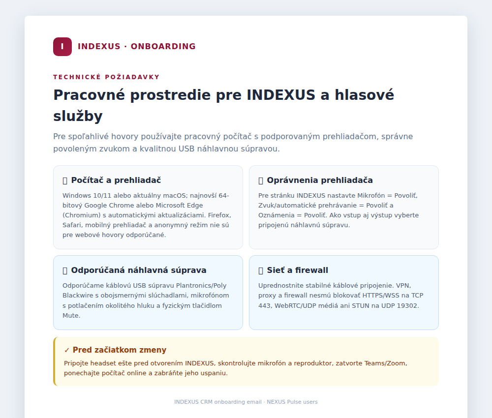

# NEXUS Pulse — kontrola pripravenosti pred telefonovaním

## Na čo kontrola slúži

Pred otvorením pracoviska NEXUS Pulse systém skontroluje, či je počítač, prehliadač, zvuk a telefonické spojenie pripravené na hovory. Kontrola chráni používateľa pred situáciou, keď by počas hovoru nefungoval mikrofón, zvuk alebo SIP spojenie.

Kontrola sa zobrazí až po prihlásení a iba používateľom, ktorí majú oprávnenie na modul **NEXUS Pulse**. Ostatné časti INDEXUS zostávajú dostupné.

Počas kontroly sa zvuk **nenahráva ani neukladá** a žiadny testovací zvuk sa neposiela na server.

## Informácie už v onboardingovom e-maile

Používateľ dostane základnú prípravu ešte pred prvým prihlásením. Onboardingový e-mail pre používateľov hlasových služieb a NEXUS Pulse obsahuje odporúčané technické zabezpečenie a softvérové požiadavky:

- pracovný počítač s Windows 10/11 alebo aktuálnym macOS,
- najnovší 64-bitový Google Chrome alebo Microsoft Edge s automatickými aktualizáciami,
- povolený mikrofón, zvuk/automatické prehrávanie a oznámenia pre stránku INDEXUS,
- odporúčanú káblovú USB náhlavnú súpravu Plantronics/Poly Blackwire,
- požiadavky na sieť a firewall: HTTPS/WSS na TCP 443, WebRTC/UDP médiá a STUN na UDP 19302,
- kroky pred začiatkom zmeny vrátane pripojenia headsetu, kontroly zvuku, zatvorenia Teams/Zoom a zabránenia uspatiu počítača.

Onboardingový e-mail slúži ako príprava pracoviska. Kontrola pripravenosti pri vstupe do Pulse následne overí, či aktuálne prostredie tieto požiadavky skutočne spĺňa.

## Ako kontrolu spustiť

1. V ľavom menu otvorte **NEXUS Pulse** alebo kliknite na stavovú ikonu Pulse v hornej lište.
2. Kliknite na **Spustiť kontrolu pripravenosti**.
3. Ak prehliadač požiada o prístup k mikrofónu, povoľte ho.
4. Kliknite na **Prehrať testovací zvuk**.
5. Ak ste zvuk počuli, označte **Počul(a) som testovací zvuk**.
6. Podľa potreby povoľte oznámenia pre prichádzajúce hovory.
7. Keď sú všetky povinné kontroly úspešné, kliknite na **Pokračovať do pracoviska**.

Samotné potvrdenie testovacieho zvuku nestačí. Systém dovolí pokračovať až po dokončení celej kontroly a bez kritickej chyby.

## Význam celkových stavov

| Stav | Význam | Čo má používateľ urobiť |
|---|---|---|
| **Kontrolujem nastavenie hovorov…** | Kontrola ešte prebieha alebo nebola dokončená. | Počkajte alebo spustite kontrolu. |
| **Pripravené na hovory** | Všetky povinné kontroly prešli bez chyby. | Môžete vstúpiť do pracoviska. |
| **Pripravené s upozorneniami** | Povinné kontroly prešli, ale systém našiel odporúčanie. | Môžete pokračovať; odporúčanie je vhodné skontrolovať. |
| **Vyžaduje pozornosť** | Aspoň jedna povinná kontrola zlyhala. | Opravte označený problém a spustite kontrolu znova. |

## Povinné kontroly

Zlyhanie ktorejkoľvek z týchto kontrol zablokuje vstup do pracoviska NEXUS Pulse.

### 1. Podporovaný prehliadač

- Vyžaduje sa aktuálny desktopový prehliadač založený na Chromium, napríklad Google Chrome alebo Microsoft Edge.
- Mobilný prehliadač nie je podporovaný.
- Firefox, Opera a Samsung Browser kontrolou neprejdú.
- Starý uložený úspešný stav sa v nepodporovanom prehliadači automaticky zruší.

### 2. Bezpečné pripojenie

- Produkčné prostredie musí byť otvorené cez bezpečné HTTPS spojenie.
- Nezabezpečené spojenie nemôže používať mikrofón a telefonické funkcie spoľahlivo.
- Pri strate bezpečného prostredia sa uložená pripravenosť nepoužije.

### 3. Pripojenie na internet

- Prehliadač musí byť online.
- Pri prechode do offline režimu sa pripravenosť zruší a kontrola sa musí zopakovať.

### 4. Povolenie mikrofónu

- Prehliadač musí mať povolený prístup k mikrofónu.
- Ak používateľ prístup zamietne, treba ho povoliť v nastaveniach stránky v prehliadači a kontrolu spustiť znova.
- Testovací prístup k mikrofónu sa po kontrole ukončí.

### 5. Zvukový vstup

- Systém musí nájsť aspoň jeden mikrofón alebo vstup zo slúchadiel.
- Ak sa vstup nenájde, skontrolujte pripojenie USB/Bluetooth zariadenia a nastavenie zvuku v operačnom systéme.

### 6. Zvukový výstup

- Systém musí nájsť reproduktor alebo slúchadlá.
- Ak sa výstup nenájde, pripojte zariadenie a obnovte kontrolu.

### 7. Testovací zvuk

- Používateľ musí najprv kliknúť na **Prehrať testovací zvuk**.
- Až potom môže potvrdiť možnosť **Počul(a) som testovací zvuk**.
- Ak zvuk nepočuť, treba skontrolovať hlasitosť, stlmenie a vybrané výstupné zariadenie.
- Potvrdenie zvuku nikdy neobíde ostatné povinné kontroly.

### 8. Registrácia SIP/WSS

- Systém overuje, či je vstavaný telefón zaregistrovaný a pripravený na hovory.
- Ak registrácia nie je pripravená, skontrolujte internetové pripojenie a skúste kontrolu zopakovať.
- Krátky výpadok SIP po úspešnom vstupe má 14-sekundovú toleranciu. Ak sa spojenie neobnoví, pripravenosť sa zruší.

## Upozornenia, ktoré neblokujú telefonovanie

Tieto výsledky môžu zobraziť stav **Pripravené s upozorneniami**, ale používateľ môže pokračovať.

### 9. Sieťová cesta (ICE)

- Kontrola zisťuje, či prehliadač vie vytvoriť verejnú cestu pre komunikáciu.
- Výsledok Google STUN je informačný.
- Rozhodujúcou kontrolou pripravenosti telefonovania je úspešná registrácia SIP/WSS.

### 10. Oznámenia

- Oznámenia upozorňujú na prichádzajúce hovory.
- Tlačidlo **Povoliť oznámenia** otvorí systémovú požiadavku prehliadača.
- Zamietnuté alebo nepodporované oznámenia neblokujú hovory.
- Povolenie možno neskôr zmeniť v nastaveniach stránky v prehliadači.

### 11. Typ siete

- Ethernet sa zobrazí ako odporúčaný výsledok.
- Wi‑Fi alebo neznámy typ siete vytvorí upozornenie, nie blokovanie.
- Prehliadač nedokáže spoľahlivo určiť stav VPN alebo proxy.

### 12. Udržanie obrazovky aktívnej

- Systém sa pokúsi zabrániť uspaniu obrazovky počas práce.
- Ak prehliadač funkciu nepodporuje alebo ju zamietne, používateľ môže telefonovať ďalej.

### 13. Zvukové zariadenia

- Ak systém nájde viac mikrofónov alebo výstupov, upozorní používateľa.
- Pred prvým hovorom treba skontrolovať, či je vybrané správne headsetové zariadenie.

## Tlačidlá a ovládacie prvky

| Prvok | Funkcia |
|---|---|
| **Spustiť kontrolu pripravenosti** | Spustí všetky automatické kontroly. |
| **Spustiť kontrolu znova** | Zopakuje kontrolu po oprave problému. |
| **Prehrať testovací zvuk** | Prehrá krátky lokálny tón. |
| **Počul(a) som testovací zvuk** | Potvrdí funkčný zvukový výstup; dostupné až po prehratí tónu. |
| **Povoliť oznámenia** | Požiada prehliadač o povolenie oznámení. |
| **Pokračovať do pracoviska** | Otvorí Agent Workspace, iba ak prešli všetky povinné kontroly. |
| **Späť do INDEXUS** | Bez obídenia kontroly opustí Pulse a vráti používateľa na domovskú stránku určenú jeho rolou. |
| **Zavrieť** | Zavrie dobrovoľne otvorenú diagnostiku mimo povinného vstupu. Neudeľuje pripravenosť. |

## Stavová ikona v hornej lište

Kompaktná ikona NEXUS Pulse obsahuje farebnú bodku:

- **zelená** — pripravené na hovory,
- **oranžová** — pripravené s upozorneniami alebo krátky výpadok SIP v tolerancii,
- **červená** — blokované alebo zneplatnené prostredie,
- **sivá** — kontrola prebieha alebo ešte nebola dokončená.

Po podržaní kurzora sa zobrazí názov a aktuálny stav. Kliknutím na ikonu sa otvorí diagnostika.

## Platnosť úspešnej kontroly

- Úspech sa ukladá iba pre aktuálnu kartu alebo reláciu prehliadača.
- Ukladá sa oddelene pre každého prihláseného používateľa.
- Nejde o trvalé schválenie zariadenia.
- Uložený úspech sa nepovažuje za dôkaz pripravenosti v inom alebo nepodporovanom prostredí.
- Pri každom načítaní sa minimálne znovu posúdi podporovaný prehliadač, bezpečné spojenie a online stav.
- Zmena siete, zmena zvukových zariadení, prechod offline alebo dlhšie uspatie počítača pripravenosť zruší.

## Bezpečný návrat do INDEXUS

Ak povinná kontrola neprejde, používateľ nie je uväznený v diagnostike. Tlačidlo **Späť do INDEXUS** ho vráti na landing page nastavenej pre jeho rolu. Ak je landing page používateľa samotný Agent Workspace, systém použije hlavnú stránku INDEXUS, aby nevznikla slučka.

Návrat do INDEXUS neoznačí kontrolu ako úspešnú. Pri ďalšom otvorení NEXUS Pulse sa povinná diagnostika zobrazí znova.

## Najčastejšie riešenia problémov

1. Použite aktuálny Google Chrome alebo Microsoft Edge na počítači.
2. Skontrolujte, že stránka používa HTTPS a počítač je online.
3. V nastaveniach stránky povoľte mikrofón.
4. Pripojte headset ešte pred spustením kontroly.
5. Skontrolujte hlasitosť a vybrané vstupné aj výstupné zariadenie.
6. Po oprave kliknite na **Spustiť kontrolu znova**.
7. Ak SIP registrácia naďalej zlyháva, kontaktujte správcu telefonického systému.
