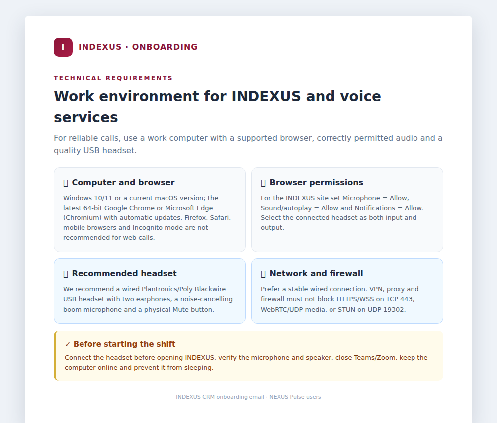
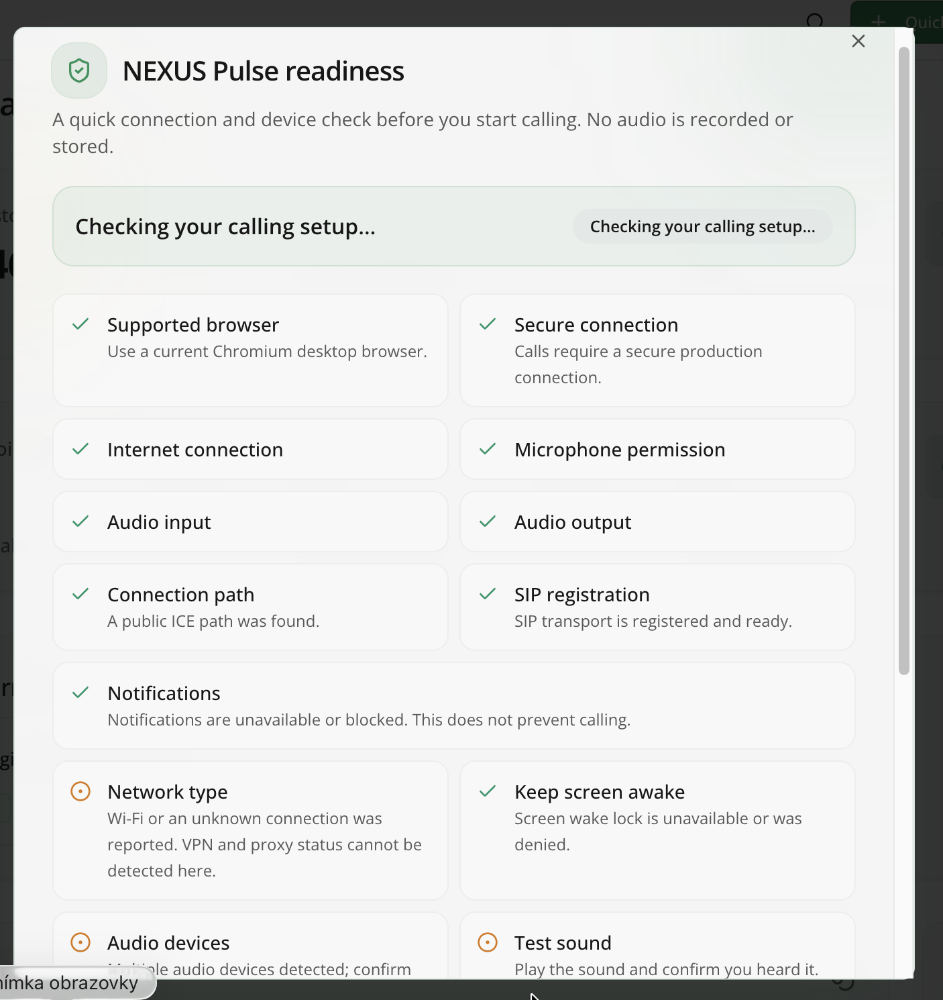
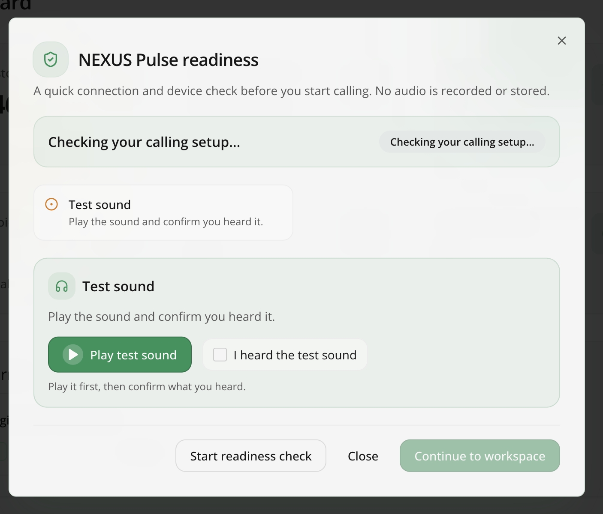
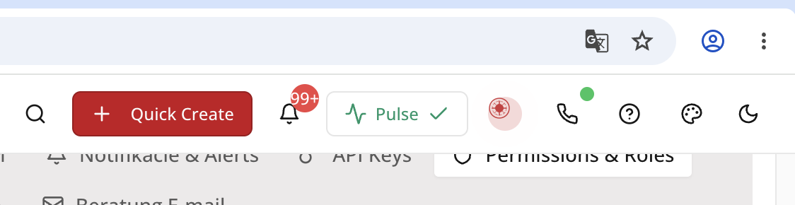

# NEXUS Pulse — readiness check before calling

## Purpose of the check

Before opening the NEXUS Pulse Agent Workspace, the system checks whether the computer, browser, audio devices, and telephony connection are ready for calls. This prevents agents from starting work without a functioning microphone, audio output, or SIP connection.

The check appears after authentication and only for users who have permission to access **NEXUS Pulse**. Other parts of INDEXUS remain available.

No audio is **recorded, stored, or sent to the server** during the check.

## Information provided in the onboarding email

Users receive the basic preparation guidance before their first login. The onboarding email for voice-service and NEXUS Pulse users includes the recommended technical setup and software requirements:

- a work computer with Windows 10/11 or a current macOS version,
- the latest 64-bit Google Chrome or Microsoft Edge with automatic updates,
- Microphone, Sound/autoplay, and Notifications allowed for the INDEXUS site,
- a recommended wired Plantronics/Poly Blackwire USB headset,
- network and firewall requirements: HTTPS/WSS on TCP 443, WebRTC/UDP media, and STUN on UDP 19302,
- pre-shift steps including connecting the headset, checking audio, closing Teams/Zoom, and preventing the computer from sleeping.

The onboarding email prepares the workstation. The readiness check performed when entering Pulse then verifies that the current environment actually meets these requirements.

## How to run the check

1. Open **NEXUS Pulse** from the left menu or click the Pulse status icon in the top bar.
2. Click **Start readiness check**.
3. Allow microphone access if the browser asks for permission.
4. Click **Play test sound**.
5. If you heard it, select **I heard the test sound**.
6. Enable browser notifications for incoming call alerts if required.
7. When every required check passes, click **Continue to workspace**.

Confirming the test sound alone is not sufficient. The system permits entry only after the complete check finishes without a critical failure.

## Overall status meanings

| Status | Meaning | What the user should do |
|---|---|---|
| **Checking your calling setup…** | The check is running or incomplete. | Wait or start the check. |
| **Ready for calls** | Every required check passed. | Continue to the workspace. |
| **Ready with notes** | Required checks passed, with one or more recommendations. | Calling is available; review the notes when possible. |
| **Action required** | At least one required check failed. | Fix the highlighted problem and run the check again. |

## Required checks

Failure of any check in this section blocks entry to the NEXUS Pulse Agent Workspace.

### 1. Supported browser

- Use a current Chromium-based desktop browser such as Google Chrome or Microsoft Edge.
- Mobile browsers are not supported.
- Firefox, Opera, Safari, and Samsung Browser do not pass the check.
- Saved readiness is automatically removed in an unsupported browser.

### 2. Secure connection

- The production environment must be opened through a secure HTTPS connection.
- An insecure context cannot reliably use microphone and telephony features.
- Saved readiness is not accepted if the current context is insecure.

### 3. Internet connection

- The browser must be online.
- Going offline immediately invalidates readiness and requires a new check.

### 4. Microphone permission

- The browser must have permission to use the microphone.
- If access was denied, allow it in the site's browser settings and run the check again.
- The temporary test stream is stopped after the check.

### 5. Audio input

- The system must find at least one microphone or headset input.
- If none is found, check the USB/Bluetooth connection and operating-system audio settings.

### 6. Audio output

- The system must find headphones, a headset, or speakers.
- Connect the device and rerun the check if no output is available.

### 7. Test sound

- First click **Play test sound**.
- Then confirm **I heard the test sound**.
- If no sound is heard, check volume, mute status, and the selected output device.
- Sound confirmation never bypasses the remaining required checks.

### 8. SIP/WSS registration

- The check verifies that the built-in telephone is registered and ready.
- If registration is not ready, check the internet connection and rerun the check.
- After successful entry, a temporary SIP interruption has a 14-second tolerance. Readiness is invalidated if the connection does not recover.

## Non-blocking recommendations

These results may produce **Ready with notes**, but they do not block calling.

### 9. Connection path (ICE)

- The browser checks whether it can establish a public communication path.
- The Google STUN result is informational.
- Successful SIP/WSS registration is the decisive network-readiness signal.

### 10. Notifications

- Browser notifications alert the agent to incoming calls.
- **Enable notifications** opens the browser permission request.
- Denied or unsupported notifications do not block calling.
- Permission can be changed later in the browser's site settings.

### 11. Network type

- Ethernet is shown as the recommended result.
- Wi-Fi or an unknown network type produces a warning, not a block.
- The browser cannot reliably detect VPN or proxy status.

### 12. Keep screen awake

- The system attempts to prevent the screen from sleeping during work.
- Calling remains available if the browser does not support this feature or permission is denied.

### 13. Audio devices

- The system warns when multiple microphones or outputs are detected.
- Verify the selected headset before the first call.

## Buttons and controls

| Control | Function |
|---|---|
| **Start readiness check** | Runs all automatic checks. |
| **Run check again** | Repeats the check after a problem has been corrected. |
| **Play test sound** | Plays a short local tone. |
| **I heard the test sound** | Confirms working audio output; available only after playing the tone. |
| **Enable notifications** | Requests browser notification permission. |
| **Continue to workspace** | Opens Agent Workspace only after all required checks pass. |
| **Return to INDEXUS** | Leaves Pulse without bypassing the check and returns to the user's role landing page. |
| **Close** | Closes an optional diagnostic dialog. It does not grant readiness. |

## Status icon in the top bar

The compact NEXUS Pulse icon contains a colored dot:

- **green** — ready for calls,
- **orange** — ready with notes or within the short SIP reconnection tolerance,
- **red** — blocked or invalidated,
- **grey** — checking or not yet completed.

Hovering over the icon shows the name and current status. Clicking it opens diagnostics.

## Validity of a successful check

- Success is stored only for the current browser tab/session.
- It is stored separately for each authenticated user.
- It is not permanent device approval.
- Saved success is not proof of readiness in another or unsupported environment.
- Supported browser, secure connection, and online state are reassessed on load.
- Network changes, audio-device changes, going offline, or a long computer sleep invalidate readiness.

## Safe return to INDEXUS

If a required check fails, the user is not trapped in diagnostics. **Return to INDEXUS** takes the user to the landing page configured for their role. If that landing page is Agent Workspace itself, the main INDEXUS page is used to prevent a redirect loop.

Returning to INDEXUS does not mark the check as successful. The protected readiness flow appears again the next time NEXUS Pulse is opened.

## Common troubleshooting steps

1. Use a current Google Chrome or Microsoft Edge desktop browser.
2. Confirm that the site uses HTTPS and the computer is online.
3. Allow microphone access in the site's browser settings.
4. Connect the headset before running the check.
5. Verify volume and the selected input and output devices.
6. Click **Run check again** after correcting the problem.
7. Contact the telephony administrator if SIP registration continues to fail.
